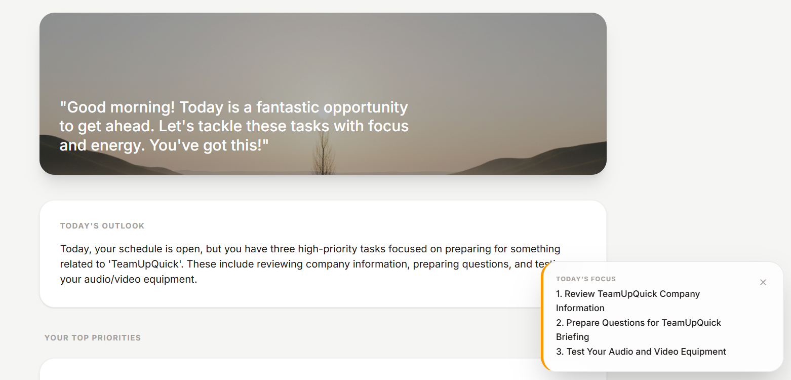
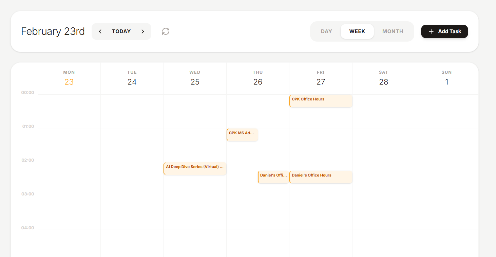
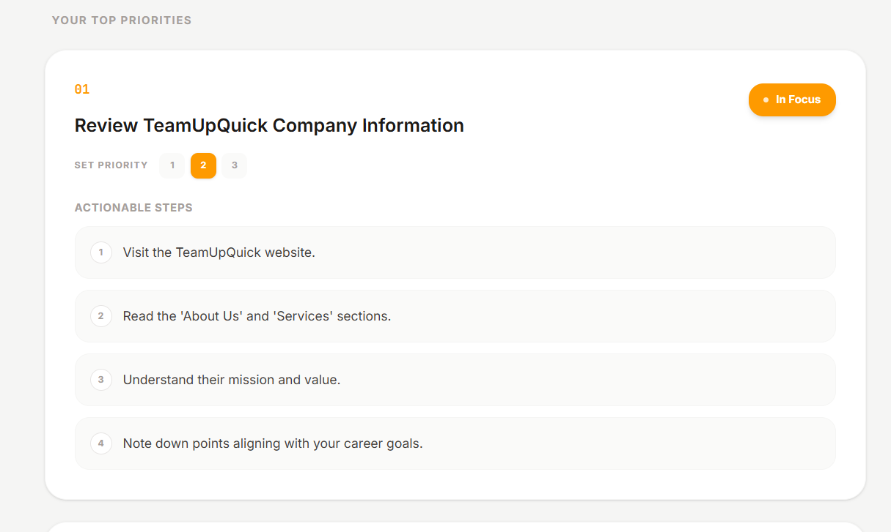
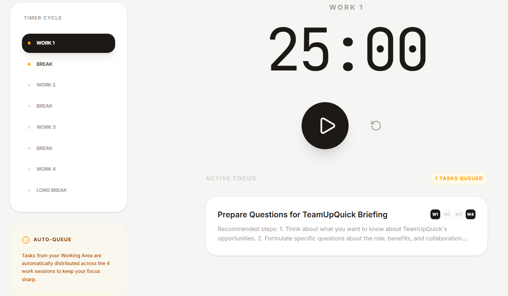

# DailyStart AI

DailyStart AI is your intelligent morning companion, designed to help you organize your day with zero friction. It synthesizes your calendar events and tasks into a personalized briefing, complete with actionable steps and a focused work environment.

## ✨ Features

### 🌅 Intelligent Morning Briefing
Start your day with a clear mind. DailyStart analyzes your upcoming schedule and priorities to generate a motivational outlook and a primary focus list.
  

  
### 🗓️ Seamless Schedule Sync
Never miss a beat. Sync your Google Calendar to visualize your commitments across daily, weekly, or monthly views, providing a comprehensive overview of your time.



### 📋 Actionable Task Management
Break down large goals into manageable steps. The AI suggests logical, actionable sub-tasks for every priority, helping you dive straight into productive work.



### 🎯 Focused Working Area
Curate your focus. Select specific tasks to move into your "Working Area," ensuring you tackle the most important things without distraction.


### ⏲️ Integrated Pomodoro Timer
Maximize your productivity with a built-in Pomodoro system. Your selected tasks are automatically queued into work sessions, complete with break reminders and audio alerts.



---

## 🚀 Getting Started

### Prerequisites
- [Node.js](https://nodejs.org/) (v18 or higher)
- A [Gemini API Key](https://aistudio.google.com/app/apikey)

### Installation

1. **Clone the repository:**
   ```bash
   git clone https://github.com/your-repo/DailyStart.git
   cd DailyStart
   ```

2. **Install dependencies:**
   ```bash
   npm install
   ```

3. **Configure Environment:**
   Create a `.env` file in the root directory (use `.env.example` as a template):
   ```env
   GEMINI_API_KEY=your_key_here
   GOOGLE_CLIENT_ID=your_id
   GOOGLE_CLIENT_SECRET=your_secret
   APP_URL=http://localhost:3000
   ```

4. **Run the application:**
   ```bash
   npm run dev
   ```
   Visit `http://localhost:3000` to start your day!

---

## 🛡️ License & Attribution

This project is licensed under the **Apache License 2.0**. See the [LICENSE](LICENSE) and [NOTICE](NOTICE) files for details.
